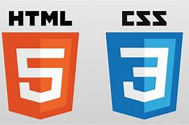

<h1 align="center">  Página de Captura(Landing-Page) - Palestra Sobre Artes Marciais </h1>

<h2>Descrição</h2>

A Página de captura(landing page) foi criado para captar o contato do potencial cliente(lead), esse potencial cliente deixa as informações de contato, por exemplo, nome, email e estado(lugar), a página em si deve estar oferecendo informações interessantes ao cliente. Tudo isso integrado com o sistema de automatização de email.
 

<h2 color=green >Projeto Finalizado</h2> 

<h2>Como Funciona</h2>
    
Já fiz o cadastro no mailchimp e integrei à página html;

    
Ele/Ela ver as informações da página e depois insere o nome, email e o estado(lugar) e aperta no botão inscreva-se;

    
Ao apertar no botão ele/ela é redirecionado a página do mailchip confirmando a inscrição;

    
Salvando os contatos dos clientes no mailchimp, posso criar e editar minhas mensagens;

    
Mensagem criada, seleciono os contatos e envio para eles/elas;

<h2>Acesso ao Projeto</h2>

Obs: As informações postas na página são fictícias.

[meu projeto](https://jasmg2002.github.io/Pagina-de-Captura--Landing-Page--Palestra-Sobre-Artes-Marciais/)
   
<h2>Tecnologias utilizadas</h2>

   
  HTML E CSS

 

   
  MAILCHIMP

### Projeto inspirado no curso de Front-End do programadorBR, no qual ensinou a criar uma landing page sem o uso de Flexbox e Grid.
  
